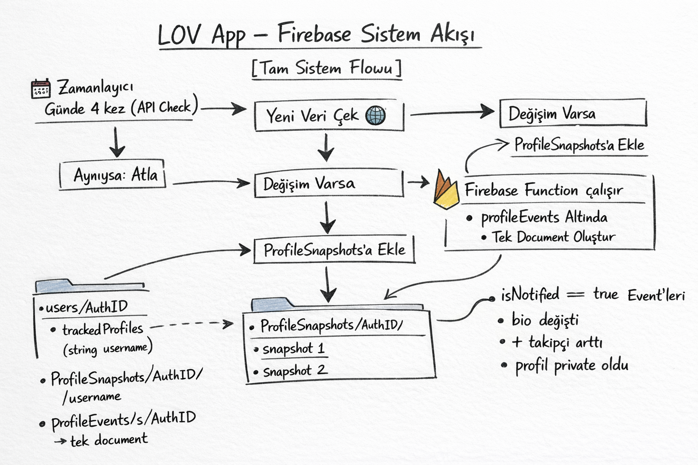

##### introduction

Back when I started 11th grade, I was seriously into a girl. Of course, because of my fear of rejection, I never told her how I felt—never even talked to her. I would constantly stalk her **Instagram** profile, checking her follower count, profile picture, etc. After a while, this started taking up a lot of my time. So I began thinking about how I could solve this problem, and the idea of building a background service came to mind.

Using a free Instagram profile scraper API I found on [RapidAPI](https://rapidapi.com/auth/login), I built a system that periodically called it via [Firebase](https://firebase.google.com) Cloud Functions and compared the results with previous snapshots. If any change was detected, a mobile notification would be sent via FCM. This made stalking much more efficient—and honestly, more enjoyable. The system wasn’t actually that complex. The core logic was based on this:

```
if(oldSnapshot.value != newSnapshot.value)
{
    //Call FCM
}
```

At the time, I didn’t have much time to invest in it, so I built a simple Android app using **Unity** and integrated Firebase dependencies just to handle notifications. Then, with a sudden decision, I shut down all functions of the project in May 2024. I threw away all the source code and structures. But the idea never stopped exciting me. That’s why it always stayed somewhere in the back of my mind...

Sometimes, certain projects form a bond with their developers. It’s like watching a chick grow day by day. ***LOV*** was my purple chick. In January 2026, I got brutally dumped. You know how it goes—false hopes, broken hearts on purpose, promises that were never kept... For about two months after that, I couldn’t really pull myself together. And honestly, nothing had any meaning for me anymore.

If you get a bad score on an exam, you can fix it in the next one. If you have a bad day, getting some rest helps. If you break your arm, just wait—it heals. For these kinds of problems, a bit of patience + effort is enough. But there are problems that simply have no solution :) Like being dumped by someone, or being short. In those cases, the most logical thing you can do is use that disappointment or stress as fuel. That’s what I did. After going through that deep sadness, the idea of turning my old stalking app into a real product helped me both recover and get myself back on track. And as of February 24, 2026, the LOV project officially began.

“LOV” is actually a pretty cool name. Its meaning is even cooler, in my opinion :) In recent years, the friendship between Turkey and Spain evolving into something closer made me like Spanish culture even more. When you’re stalking someone, that thought—“just one more time”—is unavoidable. That’s exactly where LOV comes from. It’s based on the Spanish phrase “La Otra Vez,” which means “one more time.” Of course, when factors like market optimization came into play, it evolved into LOV – Tracker and met its users. Let’s shift a bit more into the technical side and talk about the development process.

**MVP Process**

I think I’m good at building minimum viable products. Since LOV was based on my own problem, I didn’t struggle much turning it into a product. First, I had to decide which platform to develop it on. Building natively with Xcode and Android Studio didn’t make much sense for me, because I’m basically a one-man army. That means everything—from UI to coding—falls on me. Right at that moment, I decided to give FlutterFlow, known for rapid MVP development, a chance. I installed it on my MacBook and set everything up. My goal was to start coding at the beginning of March and release LOV by April 1st.




I had a pretty fast start. Of course, I had worked on mobile apps before, but those were mostly part of my learning process. Apify seemed quite strong in terms of API capabilities, so I chose to use it. Development continued until April 1st, and I genuinely enjoyed the process. As you might guess, I didn’t make it by April 1st—but on February 26, LOV was released with support for more than 12 languages.

Of course, summarizing the release process in one sentence would be unfair. Let’s talk about publishing, which was much harder than development.

**App Store Nightmare**

You don’t need to be an experienced iOS developer or Apple user to understand how strict Apple’s ecosystem is—a brief experience is enough. LOV, by its nature, creates artificial profiles about people. Guess who hates that concept: Apple.

Luckily, the Play Store side isn’t as strict as Apple, which can reject an app three times. The fact that I had opened my Play Console developer account at the age of 14 made things easier, and my app was approved and published within 48 hours. Even though LOV hasn’t achieved major success yet, I’m aiming for significant download numbers after making some changes to the pricing strategy.

**Conclusion**

There’s no rule that every product has to succeed. Most likely, it won’t. I think the important part is what you learn while building it. I learned a lot while developing LOV—like how I need to build MVPs faster, and how developing the product is actually the smallest part of mobile app development.

When I look at the story of LOV from a broader perspective, I see that pain can be a form of fuel. Some people affect you deeply. First, they enter your life, then your heart—and then they leave in such a way that you don’t even understand what happened. What comes next is predictable; sometimes a poem, sometimes a song, sometimes a LOV is born. You never really understand whether it was good or bad. And maybe the point is that you never fully understand it.

“The harbors were calm—you were the reason.” And then you walk away...
