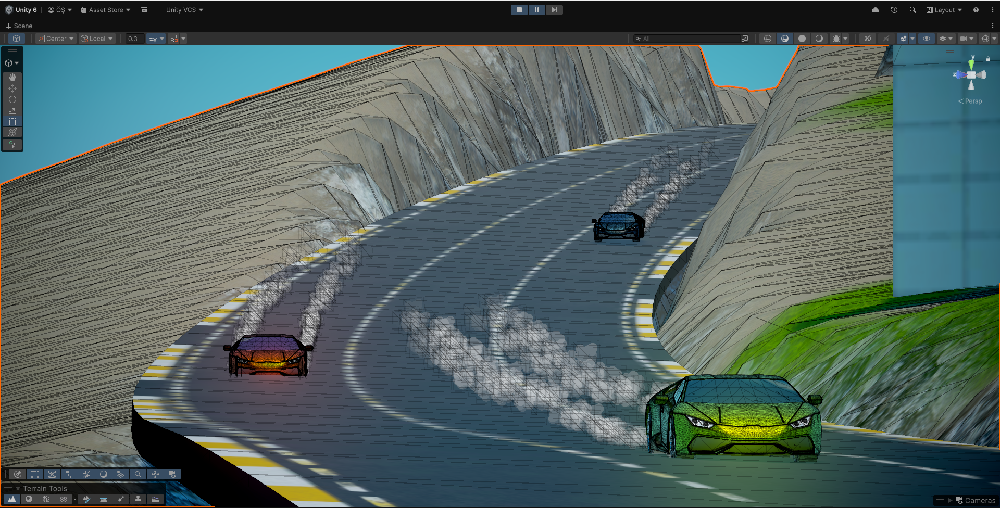
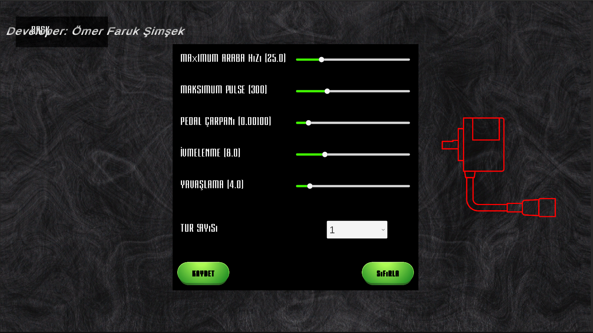
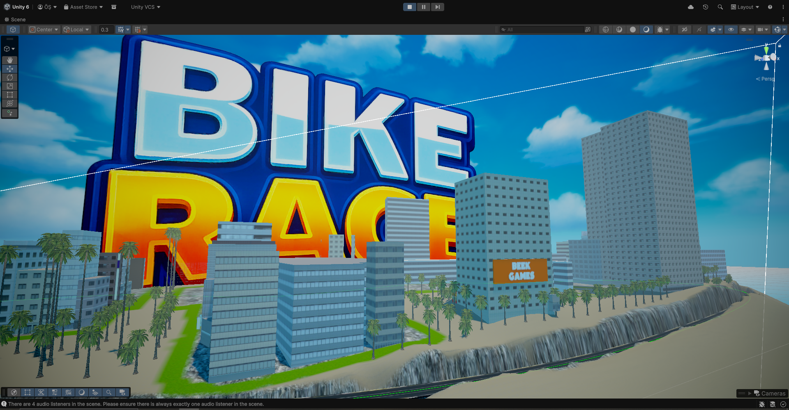
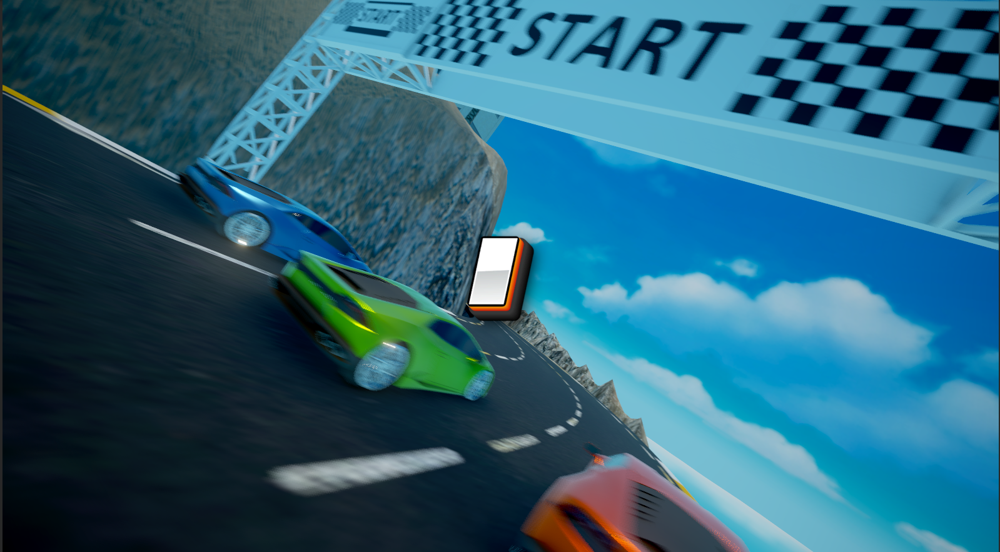
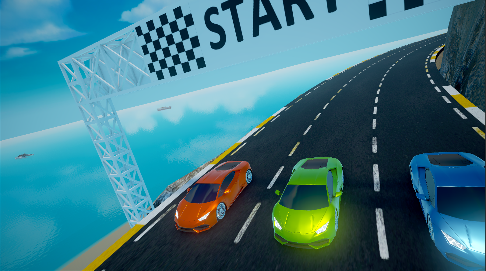
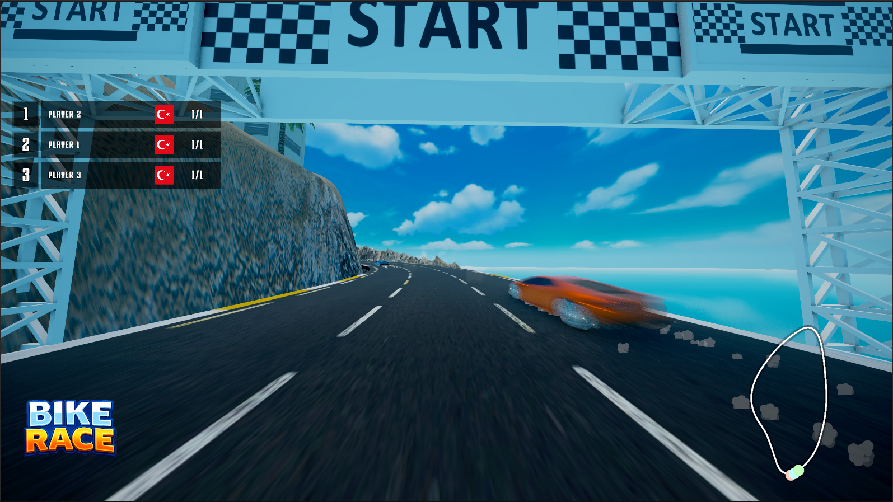

BIKE CAR was developed as a custom interactive attraction for an entertainment venue, allowing three players to compete simultaneously by riding real exercise bikes. Instead of using traditional game controllers, each bike is equipped with an industrial rotary encoder connected to an Arduino Mega 2560. The system continuously measures each player's pedaling speed and transmits the data to Unity in real time, where it directly controls the acceleration of each racing vehicle.

The project required both hardware and software development, including custom electronics, embedded programming, real-time serial communication, and game development. Since the physical hardware was unavailable during much of development, a complete keyboard-based encoder simulation system was created to emulate real sensor input, allowing the entire gameplay system to be developed and tested before the final installation.

To provide an engaging experience, the game includes dynamic camera transitions that automatically follow the leading racer, responsive engine audio that changes according to player speed, tire smoke effects, finish-line celebrations, and a complete winner presentation sequence.

How It Works

* Three players ride stationary exercise bikes simultaneously.
* Industrial rotary encoders measure each bike's pedal rotation.
* Arduino Mega processes encoder signals in real time.
* Unity receives live serial data from the Arduino.
* Each player's pedaling speed directly determines their vehicle's acceleration.
* The fastest rider reaches the finish line first and wins the race.

Key Features

* Real exercise bike integration with in-game vehicle control.
* Industrial rotary encoder-based pedal tracking.
* Real-time serial communication between Arduino and Unity.
* Three-player local multiplayer racing.
* Dynamic camera system that follows the race leader.
* Keyboard-based hardware simulation mode for development and testing.
* Tire smoke, speed effects, and polished race presentation.
* Adaptive engine audio that responds to player speed.
* Complete winner sequence with animations and sound transitions.
* Designed for continuous commercial deployment in entertainment venues.

Technical Details

Game Engine: Unity

Programming Language: C#

Microcontroller: Arduino Mega 2560

Sensors: Industrial Rotary Encoders

Communication: USB Serial Communication

Platform: Windows PC

Graphics: 3D

Players: 3 (Local Multiplayer)

Architecture: Hardware–Software Integration

Core Logic: Real-time pedal speed measurement, Arduino-to-Unity communication, and physics-based vehicle control.

