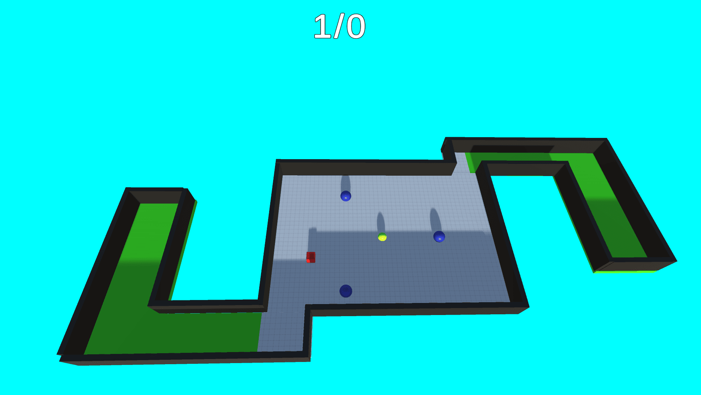
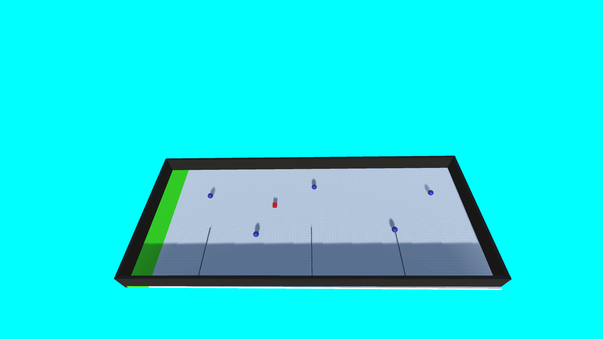
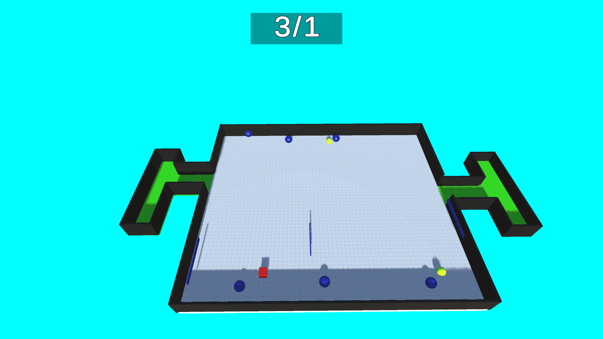

Cube Master is a precision-based obstacle game inspired by the popular "World's Hardest Game" style. Players guide a red cube through increasingly difficult obstacle courses while avoiding hazards and reaching the finish line.

### Key Features

* Precision movement mechanics.
* Challenging obstacle courses.
* Progressive difficulty.
* Instant restart system.
* Minimalist gameplay design.

### Technical Details

Game Engine: Unity 2020

Programming Language: C#

Platform: Windows

Genre: Puzzle / Skill-Based

Core Logic: Precision movement, obstacle collision system, checkpoint management, and level progression.

