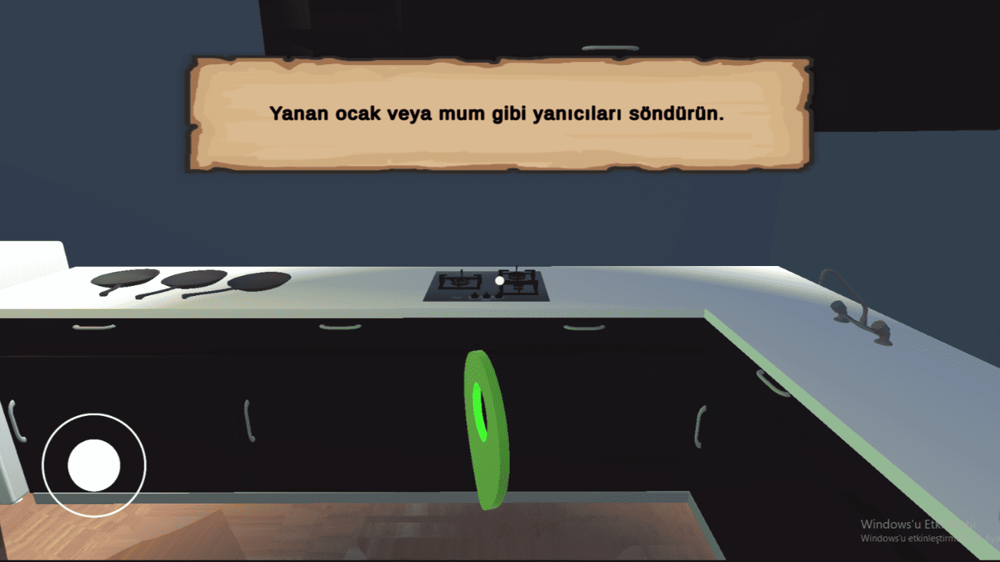
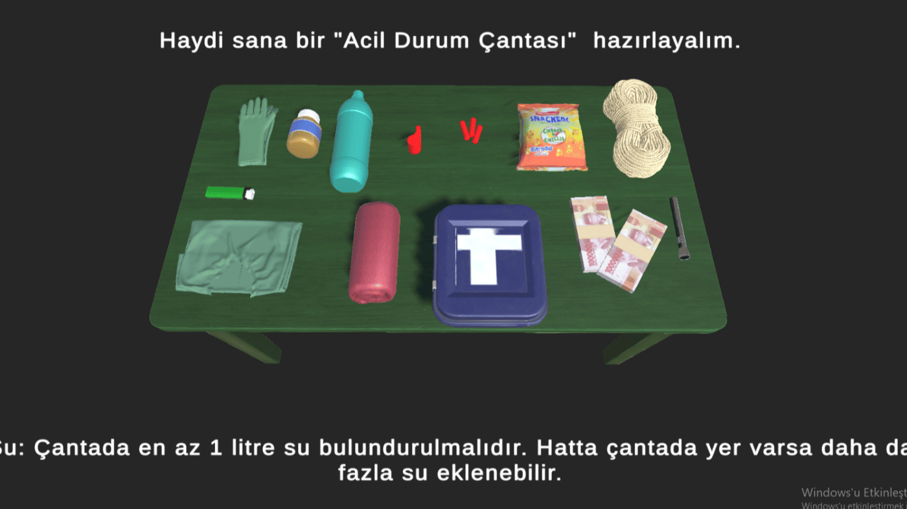
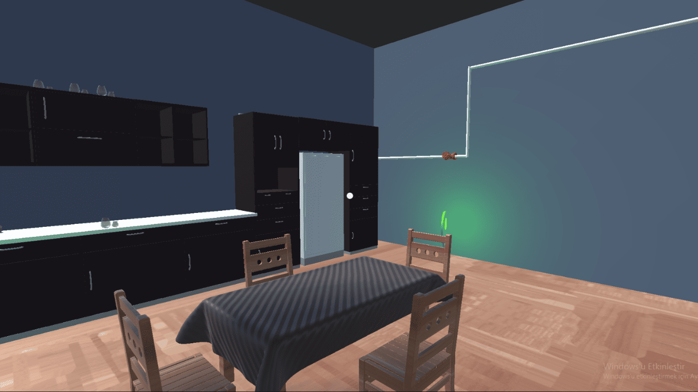

Developed after the devastating February 6, 2023 earthquake in Malatya, this project aims to educate users through interactive scenarios. The game consists of three main sections: preparing an emergency kit, taking safe positions during an earthquake, and post-earthquake evacuation procedures. Players make decisions at each stage, simulating real-life situations and learning appropriate responses. The project focuses on social impact, combining awareness with behavioral learning.

**Technical Details**

* Game Engine: Unity
* Platform: Mobile (Android)
* Architecture: Scene-based modular structure
* UI/UX: Interactive scenario-driven interface
* Logic: Decision-based progression system

  

  
