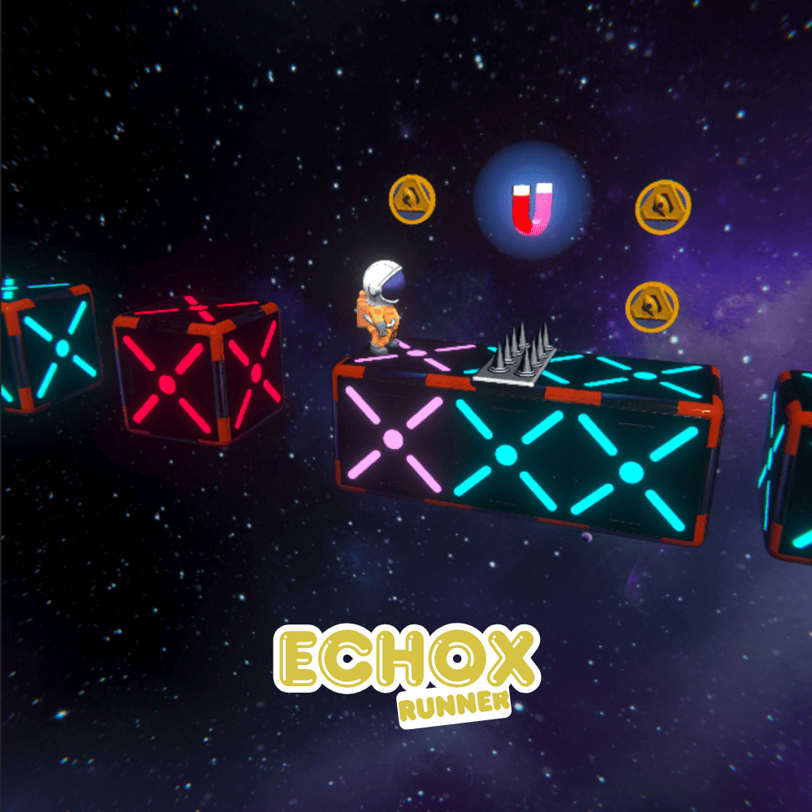

In this game, players navigate through a space environment, avoid obstacles, and collect coins. The collected currency can be used for upgrades in the in-game store. Developed for a publisher, the project focuses on performance and monetization.

**Technical Details**

* Engine: Unity
* Genre: Endless Runner
* Mechanics: Procedural level generation
* Systems: In-game shop and upgrades
* Optimization: Mobile performance optimization
