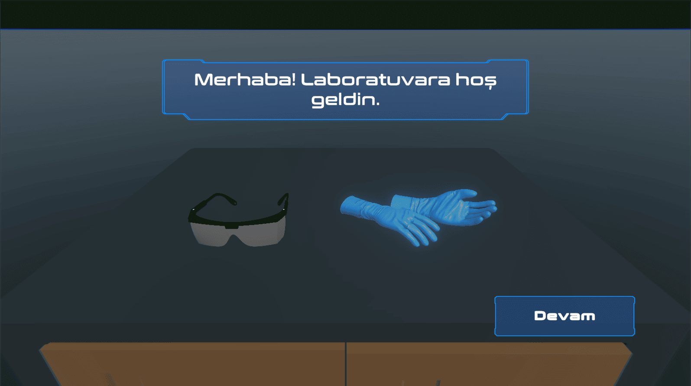
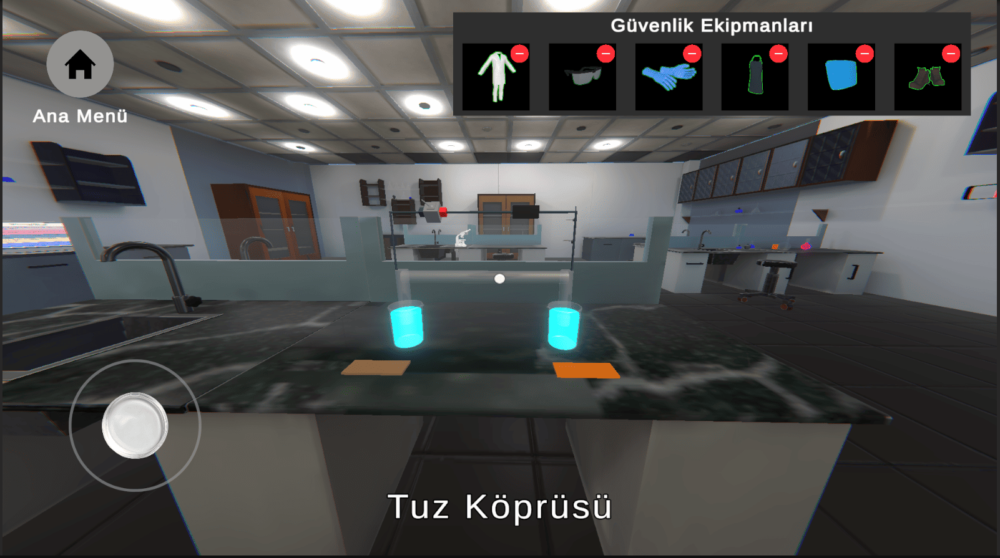
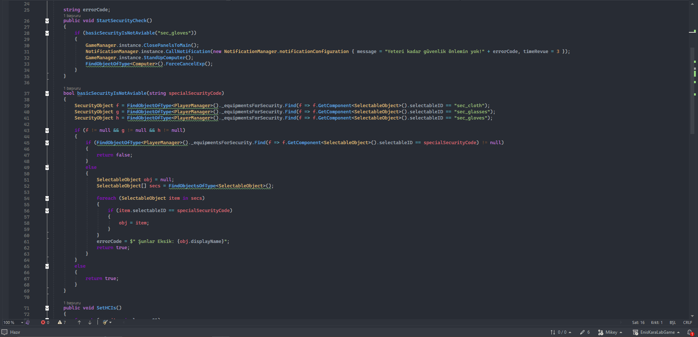
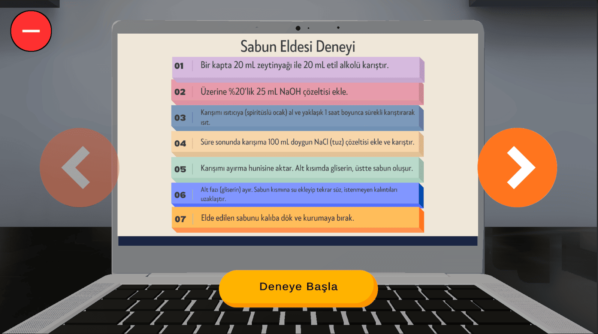
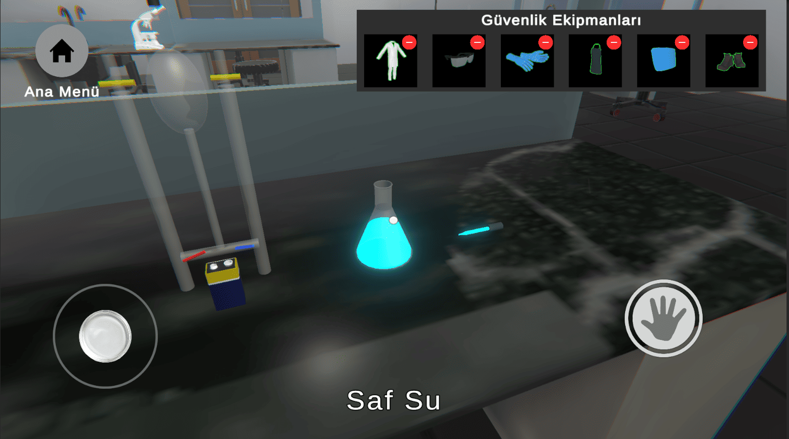
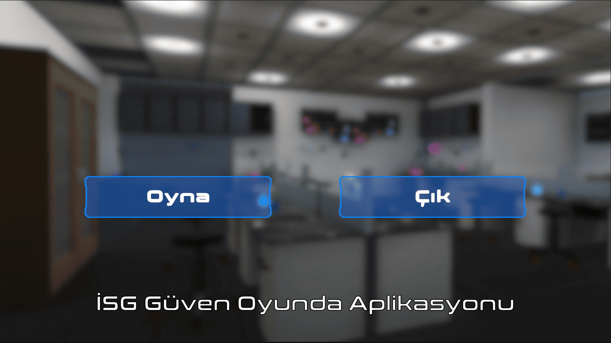

**OHS: Safety in Action** (*İSG Güven Oyunda*) reimagines traditional occupational health and safety training by transforming a standard chemistry lab into an interactive, gamified simulation. Developed specifically for chemistry education, the application guides users through practical lab procedures while strictly monitoring OHS behaviors, ensuring that theoretical safety protocols are learned through active practice.

The core technical challenge of the project lay in translating complex, multi-stage real-world chemistry experiments into code. To manage the vast number of user variables—such as equipping the correct safety gear (goggles, gloves, lab coats) and maintaining the precise procedural order of operations—a robust dynamic validation system was implemented. The architecture prevents players from advancing if critical safety measures are missing, displaying contextual warnings and guiding them through a dynamic state-machine. Whether measuring olive oil for soap production or setting up interactive test tubes, every player action undergoes sequential verification to map all possible failure points and combinations accurately.

The simulation features five comprehensive chemistry experiments, including soap making, the electrolysis of water, and the Hoffmann voltameter experiment. By combining precise dynamic text indicators with reactive item interaction states, the project successfully eliminates user confusion in a high-density operational environment, making it a reliable digital learning tool for academic and commercial education deployment.

### How It Works

* Players log into the digital laboratory environment and receive step-by-step experiment instructions from the in-game computer interface.
* Before approaching any workstation, players must explore the laboratory to collect and equip mandatory personal protective equipment (PPE).
* The validation engine scans the player's active equipment array; if any required item is missing, the system locks progression and triggers an OHS alert.
* Once cleared for safety, players interact with realistic laboratory apparatus to measure, pour, and mix chemical ingredients sequentially.
* The system monitors fluid amounts and tool choices in real time, validating the chemical workflow across multiple procedural stages.
* Completing all execution steps successfully concludes the experiment, reinforcing safe and accurate laboratory habits.

### Key Features

* OHS Dress-Code Verification: A conditional validation system that verifies player equipment states before allowing interaction with lab materials.
* Complex Formula Management: A dynamic workflow state-machine built to handle multiple chemical combinations, prevention logic, and exact procedural order.
* Interactive 3D Chemistry Workstations: Highly detailed virtual lab environments featuring functional beakers, test tubes, and measuring cylinders.
* Contextual User Guidance: High-precision name labels and real-time guidance prompts that adapt instantly based on the current experiment phase.
* Diverse Experiment Catalog: Native software support for 5 distinct chemistry milestones, ranging from soap composition to industrial electrolysis simulations.
* Mobile-Ready Performance Optimization: Built entirely within a lightweight architecture designed for smooth performance on targeted user devices.

### Technical Details

* Game Engine: Unity (Universal Render Pipeline - URP)
* Programming Language: C#
* Architecture: Component-Based Validation Framework & State Machine Logic
* UI Architecture: Dynamic Label Rendering & Inventory Canvas System
* Platform: Mobile / Windows PC (Optimized Cross-Platform Input)
* Graphics: 3D Low-Poly Stylized Realism
* Core Logic: Multi-conditional safety checks, sequential workflow tracking, runtime asset interaction, and data-driven ingredient volume checking.

