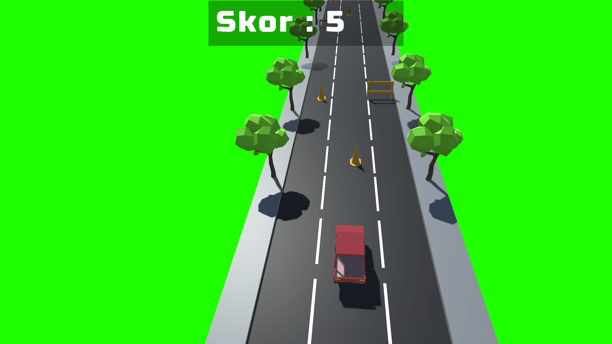
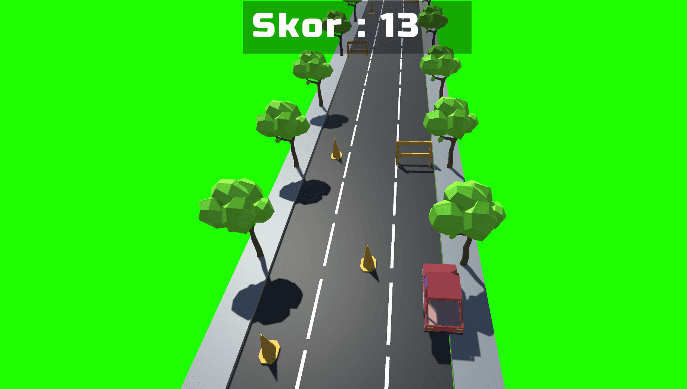
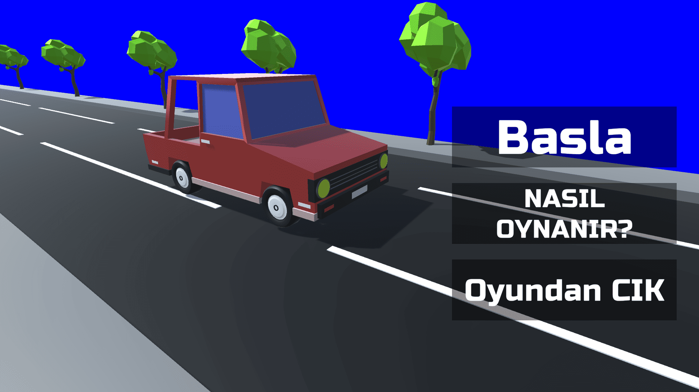

Sneaky Driver is an endless driving game where players avoid obstacles, survive for as long as possible, and achieve the highest score. The project was developed in Unity 2020 as one of my earliest freelance projects.

### Key Features

* Endless driving gameplay.
* Dynamic obstacle spawning.
* High score system.
* Smooth vehicle controls.
* Progressive gameplay difficulty.

### Technical Details

Game Engine: Unity 2020

Programming Language: C#

Platform: Windows

Genre: Endless Driving

Core Logic: Endless level generation, obstacle management, score tracking, and vehicle controller.

1. 

   
