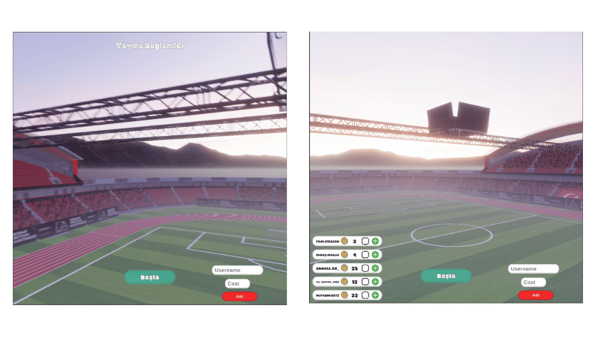
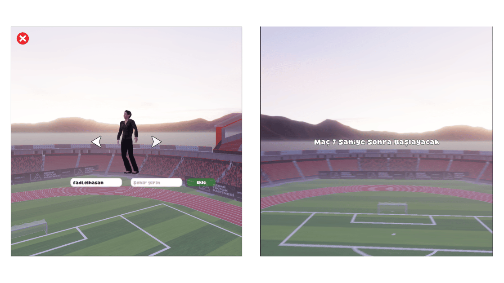
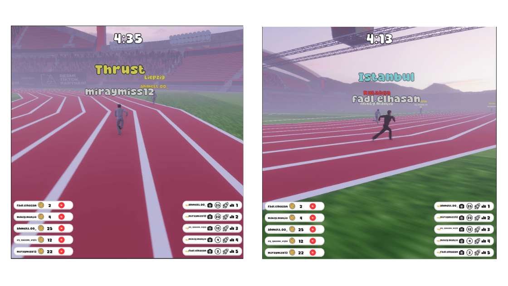
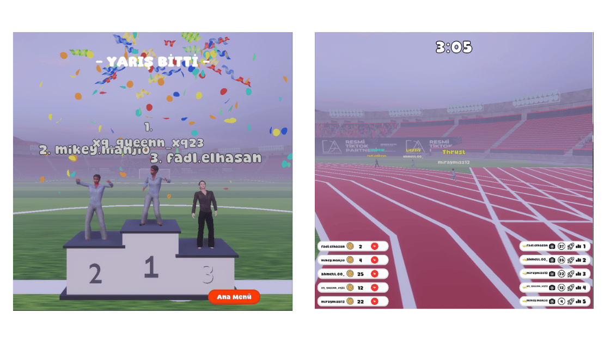
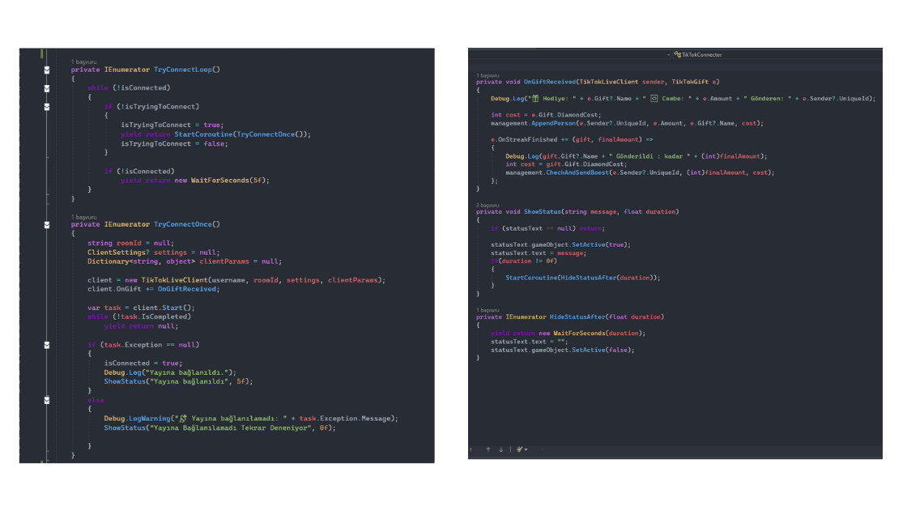

**TikTok Runners** bridges the gap between social media broadcasting and real-time game development, turning passive stream viewers into active game participants. Designed for content creators and modern stream engagement platforms, the system listens to live TikTok API events to spawn, manage, and manipulate 3D runners dynamically based on real-time viewer actions.

The project required an event-driven architecture capable of handling high-frequency network data without dropping frames. When a viewer sends a designated gift, the system captures their user profile and dynamically instantiates a unique 3D character node on the track. The player's TikTok handle is automatically rendered right above the runner's head. If multiple viewers choose to back the same province, the system dynamically handles the load by spawning distinct, individual runners for each user, assigning unique identifiers to manage their logic independently.

Beyond simply joining the race, viewers can actively alter the course of the competition through strategic interaction. By sending specific publisher-defined offensive gifts, they can trigger an interactive attack sequence that knocks down targeted rival runners, taking them out of commission for 5 seconds before they automatically recover and continue the race. The entire core gameplay operates on a continuous state-machine cycle that automatically resets after each 5-minute race, ensuring continuous commercial deployment for 24/7 automated live streams.

### How It Works

* Viewers join the live stream and send targeted TikTok gifts to select and spawn their runner.
* Unity receives live asynchronous gift and user data from the TikTok API client framework.
* The system dynamically instantiates a new 3D runner and links the viewer's username above the character.
* Viewers strategically disrupt opponents by sending specific high-tier gifts to trigger a 5-second knockdown sequence.
* The system tracks gift combos and streaks to apply performance updates in real time.
* The fastest runner crosses the finish line, triggering a winner presentation that highlights the winning user's handle on the stream overlay before automatically resetting the game loop.

### Key Features

* Live API & Metadata Integration: Real-time extraction of live TikTok stream gift events, combo statuses, and user profile data.
* Dynamic Node Spawning: Runtime instantiation of unique 3D runner nodes map-linked to dynamic player profiles.
* Streak & Combo Handling: Event-driven listening architecture (`OnStreakFinished`) optimized for processing high-frequency gift actions smoothly.
* Interactive Combat System: Real-time strategic mechanics allowing viewers to trigger timed knockdowns on rival competitors.
* Automated Network Stability: Coroutine-based network handlers (`TryConnectLoop`) featuring automated connection retry logic and status feedback UI.
* Continuous Broadcast Loop: Fully automated state-machine cycles that handle game setup, racing logic, winner presentation, and system flushes without human intervention.

### Technical Details

* Game Engine: Unity
* Programming Language: C#
* API & SDK Integration: TikTokLiveClient Framework
* Communication Protocol: Asynchronous Event Handling (WebSockets)
* Architecture: Event-Driven System (Callback Observers for Gift Events)
* Platform: Windows PC (Streaming Setup)
* Graphics: 3D
* Core Logic: Async API connection loops, data-driven node instantiating, dynamic name-label text rendering, and automated runner state machines.

